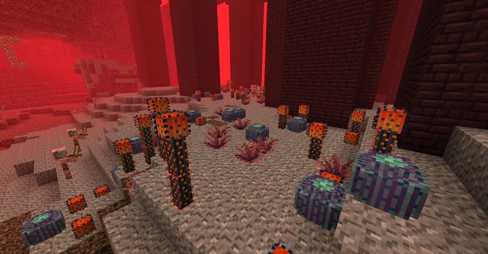
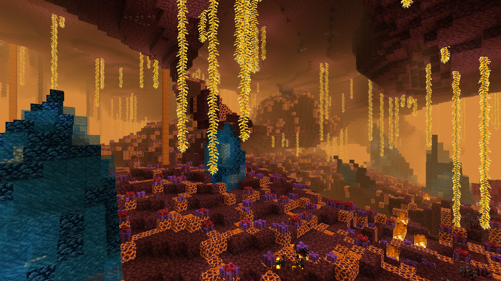
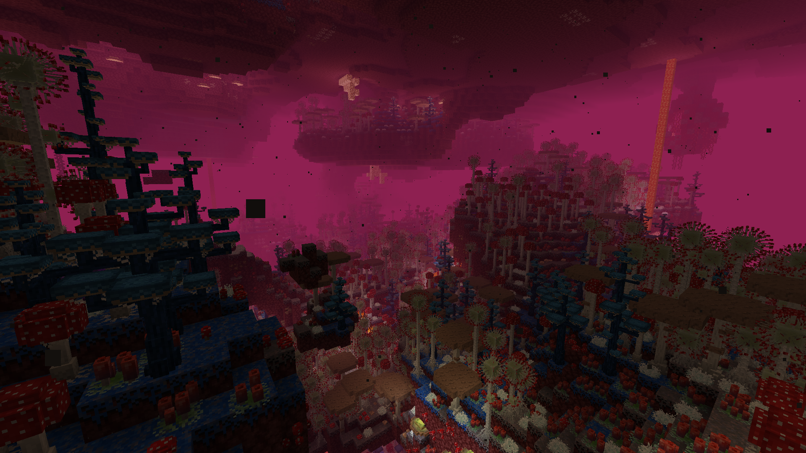
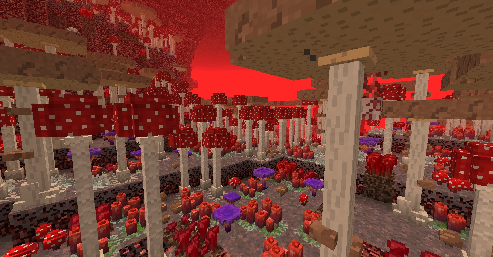
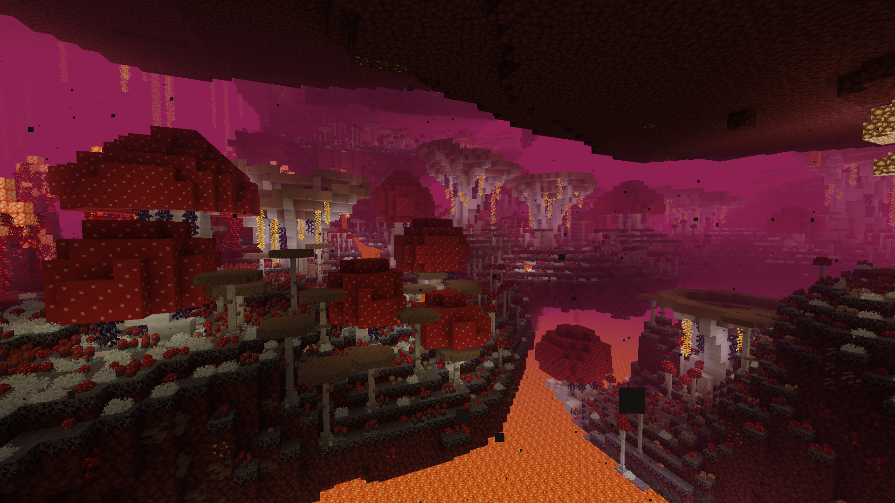
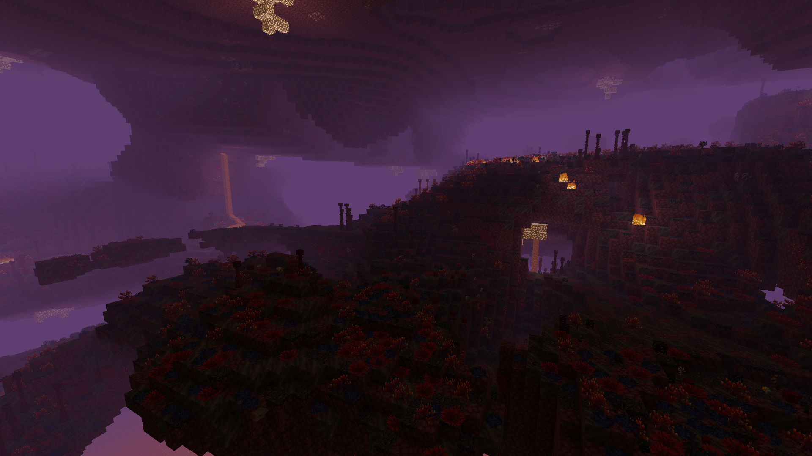
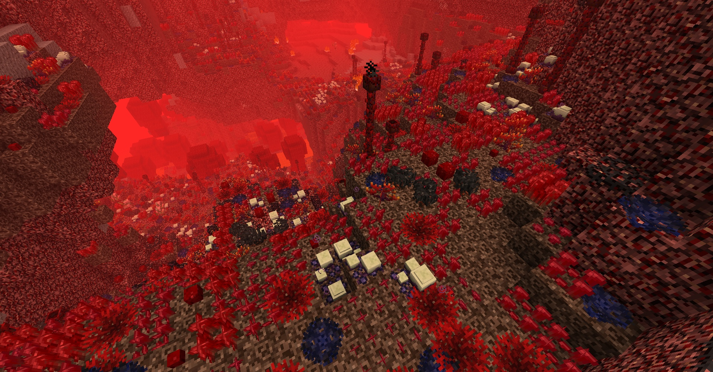
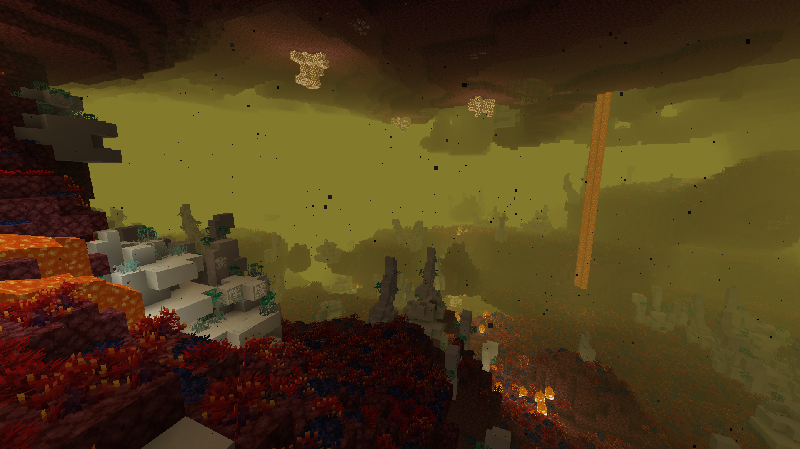
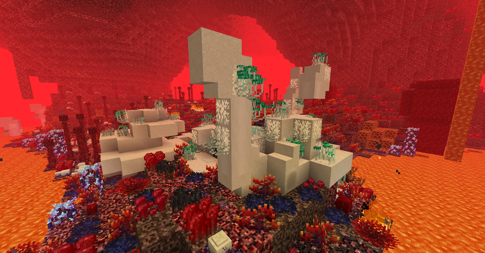
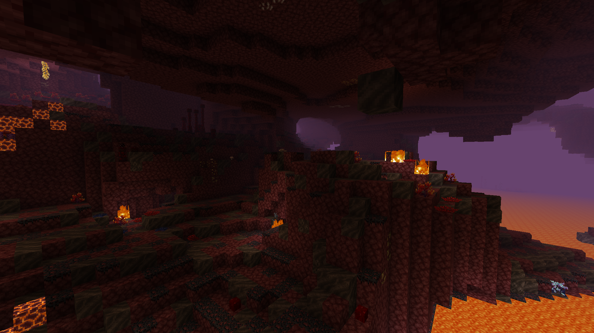

[**Main Page**](https://github.com/paulevsGitch/BetterNether/wiki)

Biomes in mod are volumetric - they have vertical and horizontal variance. As a result you can find another biome digging up or down. Each biome has unique environment and plants.

## Biome List:
* [Empty Nether](https://github.com/paulevsGitch/BetterNether/wiki/Biomes#empty-nether)
* [Gravel Desert](https://github.com/paulevsGitch/BetterNether/wiki/Biomes#gravel-desert)
* [Magma Land](https://github.com/paulevsGitch/BetterNether/wiki/Biomes#magma-land)
* [Mushroom Forest](https://github.com/paulevsGitch/BetterNether/wiki/Biomes#mushroom-forest)
* [Nether Grasslands](https://github.com/paulevsGitch/BetterNether/wiki/Biomes#nether-grasslands)
* [Nether Jungle](https://github.com/paulevsGitch/BetterNether/wiki/Biomes#nether-jungle)
* [Nether Swampland](https://github.com/paulevsGitch/BetterNether/wiki/Biomes#nether-swampland)
* [Wart Forest](https://github.com/paulevsGitch/BetterNether/wiki/Biomes#wart-forest)

## Sub-Biomes List
* [Bone Reef](https://github.com/paulevsGitch/BetterNether/wiki/Biomes#bone-reef)
* [Crimson Glowing Woods](https://github.com/paulevsGitch/BetterNether/wiki/Biomes#crimson-glowing-woods)
* [Crimson Pinewood](https://github.com/paulevsGitch/BetterNether/wiki/Biomes#crimson-pinewood)
* [Mushroom Forest Edge](https://github.com/paulevsGitch/BetterNether/wiki/Biomes#mushroom-forest-edge)
* [Nether Swampland Terraces](https://github.com/paulevsGitch/BetterNether/wiki/Biomes#nether-swampland-terraces)
* [Old Fungiwoods](https://github.com/paulevsGitch/BetterNether/wiki/Biomes#old-fungiwoods)
* [Old Warped Woods](https://github.com/paulevsGitch/BetterNether/wiki/Biomes#old-warped-woods)
* [Poor Grasslands](https://github.com/paulevsGitch/BetterNether/wiki/Biomes#poor-grasslands)
* [Soul Plain](https://github.com/paulevsGitch/BetterNether/wiki/Biomes#soul-plain)
* [Wart Forest Edge](https://github.com/paulevsGitch/BetterNether/wiki/Biomes#wart-forest-edge)

***
# Biomes

<table width="100%">
	<tr>
		<td colspan="2"><h2>Gravel Desert</h2></td>
	</tr>
	<tr>
		<td valign="top">
			

				<b>Gravel Desert</b> is a big semi-empty space of gravel fields with cactuses. It is safe for player to walk here if it is neat enough.
			

			 
			<ul>
				<li><b>Fog Color:</b> Orange</li>
				<li><b>Terrain:</b> Gravel</li>
				<li>
					<b>Plants:</b>
					<ul>
						<li>[[Agave|Plants#agave]]</li>
						<li>[[Barrel Cactus|Plants#barrel-cactus]]</li>
						<li>[[Nether Cactus|Plants#nether-cactus]]</li>
					</ul>
				</li>
				<li>
					<b>Mobs:</b>
					<ul>
						<li>[[Firefly|Mobs#firefly]]</li>
						<li>[[Hydrogen Jellyfish|Mobs#hydrogen-jellyfish]]</li>
						<li>[[Naga|Mobs#naga]]</li>
						<li><a href="https://minecraft.gamepedia.com/Enderman">Enderman (rare)</a></li>
						<li><a href="https://minecraft.gamepedia.com/Hoglin">Hoglin</a></li>
						<li><a href="https://minecraft.gamepedia.com/Magma_Cube">Magma Cube (rare)</a></li>
						<li><a href="https://minecraft.gamepedia.com/Piglin">Piglin</a></li>
						<li><a href="https://minecraft.gamepedia.com/Strider">Strider (in lava)</a></li>
						<li><a href="https://minecraft.gamepedia.com/Zombie_Pigman">Zombified Piglin</a></li>
					</ul>
				</li>
			</ul>
		</td>
		<td width="400">
			

				
			

			

				<b>Pre 1.16:</b>
			

			

				
			

		</td>
	</tr>
</table>
 

<table width="100%">
	<tr>
		<td colspan="2"><h2>Magma Land</h2></td>
	</tr>
	<tr>
		<td valign="top">
			

				<b>Magma Land</b> is a molten rock area with magma and lava veins. Big sharp obsidian crystals protrude tens of meters above the surface. Ceiling is covered with glowing vines. On the surface you can find active geysers.
			

			 
			<ul>
				<li><b>Fog Color:</b> Yellow</li>
				<li><b>Terrain:</b> Netherrack, Magma, Lava</li>
				<li>
					<b>Plants:</b>
					<ul>
						<li>[[Golden Vine|Plants#golden-vine]]</li>
					</ul>
				</li>
				<li>
					<b>Mobs:</b>
					<ul>
						<li>[[Firefly|Mobs#firefly]]</li>
						<li>[[Hydrogen Jellyfish|Mobs#hydrogen-jellyfish]]</li>
						<li>[[Naga|Mobs#naga]]</li>
						<li><a href="https://minecraft.gamepedia.com/Enderman">Enderman (rare)</a></li>
						<li><a href="https://minecraft.gamepedia.com/Ghast">Ghast</a></li>
						<li><a href="https://minecraft.gamepedia.com/Hoglin">Hoglin</a></li>
						<li><a href="https://minecraft.gamepedia.com/Magma_Cube">Magma Cube (rare)</a></li>
						<li><a href="https://minecraft.gamepedia.com/Piglin">Piglin</a></li>
						<li><a href="https://minecraft.gamepedia.com/Strider">Strider (in lava)</a></li>
						<li><a href="https://minecraft.gamepedia.com/Zombie_Pigman">Zombified Piglin</a></li>
					</ul>
				</li>
			</ul>
		</td>
		<td width="400">
			

				
			

		</td>
	</tr>
</table>
 

<table width="100%">
	<tr>
		<td colspan="2"><h2>Mushroom Forest</h2></td>
	</tr>
	<tr>
		<td valign="top">
			

				<b>Mushroom Forest</b> covered with medium-sized mushrooms and molds. It is a good place to hide from ghasts. You can find different useful mushrooms here — dye, wood and glowstone sources.
			

			 
			<ul>
				<li><b>Fog Color:</b> Magenta</li>
				<li><b>Terrain:</b> Nether Mycelium</li>
				<li><b>Subbiomes:</b>
					<ul>
						<li>[[Old Fungiwoods|#old-fungiwoods]]</li>
					</ul>
				</li>
				<li>
					<b>Mushrooms:</b>
					<ul>
						<li>[[Large Brown Mushroom|Plants#large-brown-mushroom]]</li>
						<li>[[Large Red Mushroom|Plants#large-red-mushroom]]</li>
						<li>[[Large Mold|Plants#large-mold]]</li>
						<li>[[Mushroom Fir|Plants#mushroom-fir]]</li>
						<li>[[Red Mold|Plants#red-mold]]</li>
						<li>[[Gray Mold|Plants#gray-mold]]</li>
						<li>[[Orange Mushroom|Plants#orange-mushroom]]</li>
						<li>[[Lucis|Plants#lucis]]</li>
						<li>[[Brown Wall Mushroom|Plants#brown-wall-mushroom]]</li>
						<li>[[Red Wall Mushroom|Plants#red-wall-mushroom]]</li>
						<li><a href="https://minecraft.gamepedia.com/Mushroom">Brown Mushroom</a></li>
						<li><a href="https://minecraft.gamepedia.com/Mushroom">Red Mushroom</a></li>
					</ul>
				</li>
				<li>
					<b>Mobs:</b>
					<ul>
						<li>[[Firefly|Mobs#firefly]]</li>
						<li>[[Hydrogen Jellyfish|Mobs#hydrogen-jellyfish]]</li>
						<li>[[Naga|Mobs#naga]]</li>
						<li><a href="https://minecraft.gamepedia.com/Enderman">Enderman (rare)</a></li>
						<li><a href="https://minecraft.gamepedia.com/Ghast">Ghast</a></li>
						<li><a href="https://minecraft.gamepedia.com/Hoglin">Hoglin</a></li>
						<li><a href="https://minecraft.gamepedia.com/Magma_Cube">Magma Cube (rare)</a></li>
						<li><a href="https://minecraft.gamepedia.com/Piglin">Piglin</a></li>
						<li><a href="https://minecraft.gamepedia.com/Strider">Strider (in lava)</a></li>
						<li><a href="https://minecraft.gamepedia.com/Zombie_Pigman">Zombified Piglin</a></li>
					</ul>
				</li>
			</ul>
		</td>
		<td width="400">
			

				
			

			

				<b>Pre 1.16:</b>
			

			

				
			

		</td>
	</tr>
</table>
 

<table width="100%">
	<tr>
		<td colspan="2"><h2>Old Fungiwoods</h2></td>
	</tr>
	<tr>
		<td valign="top">
			

				<b>Old Fungiwoods</b> is a subbiome for [[Mushroom Forest|#mushroom-forest]]. In addition to ordinary mushrooms, here you can find really huge ones.
			

			 
			<ul>
				<li><b>Fog Color:</b> Magenta</li>
				<li><b>Terrain:</b> Nether Mycelium</li>
				<li><b>Parent Biome:</b> [[Mushroom Forest|#mushroom-forest]]</li>
				<li>
					<b>Mushrooms:</b>
					<ul>
						<li>[[Large Brown Mushroom|Plants#large-brown-mushroom]]</li>
						<li>[[Large Red Mushroom|Plants#large-red-mushroom]]</li>
						<li>[[Red Mold|Plants#red-mold]]</li>
						<li>[[Gray Mold|Plants#gray-mold]]</li>
						<li>[[Orange Mushroom|Plants#orange-mushroom]]</li>
						<li>[[Lucis|Plants#lucis]]</li>
						<li>[[Brown Wall Mushroom|Plants#brown-wall-mushroom]]</li>
						<li>[[Red Wall Mushroom|Plants#red-wall-mushroom]]</li>
						<li><a href="https://minecraft.gamepedia.com/Mushroom">Brown Mushroom</a></li>
						<li><a href="https://minecraft.gamepedia.com/Mushroom">Red Mushroom</a></li>
					</ul>
				</li>
				<li>
					<b>Mobs:</b>
					<ul>
						<li>[[Firefly|Mobs#firefly]]</li>
						<li>[[Hydrogen Jellyfish|Mobs#hydrogen-jellyfish]]</li>
						<li>[[Naga|Mobs#naga]]</li>
						<li><a href="https://minecraft.gamepedia.com/Enderman">Enderman (rare)</a></li>
						<li><a href="https://minecraft.gamepedia.com/Ghast">Ghast</a></li>
						<li><a href="https://minecraft.gamepedia.com/Hoglin">Hoglin</a></li>
						<li><a href="https://minecraft.gamepedia.com/Magma_Cube">Magma Cube (rare)</a></li>
						<li><a href="https://minecraft.gamepedia.com/Piglin">Piglin</a></li>
						<li><a href="https://minecraft.gamepedia.com/Strider">Strider (in lava)</a></li>
						<li><a href="https://minecraft.gamepedia.com/Zombie_Pigman">Zombified Piglin</a></li>
					</ul>
				</li>
			</ul>
		</td>
		<td width="400">
			

				
			

		</td>
	</tr>
</table>
 

<table width="100%">
	<tr>
		<td colspan="2"><h2>Nether Grasslands</h2></td>
	</tr>
	<tr>
		<td valign="top">
			

				<b>Nether Grasslands</b> are grassy places with some bushes. It is safe to travel if there are no ghasts around.
			

			 
			<ul>
				<li><b>Fog Color:</b> Blue</li>
				<li><b>Terrain:</b> Nether Moss, Netherrack and Soul Soil</li>
				<li><b>Subbiomes:</b>
					<ul>
						<li>[[Bone Reef|#bone-reef]]</li>
						<li>[[Poor Nether Grasslands|#poor-nether-grasslands]]</li>
					</ul>
				</li>
				<li>
					<b>Plants:</b>
					<ul>
						<li>[[Smoker|Plants#smoker]]</li>
						<li>[[Black Bush|Plants#black-bush]]</li>
						<li>[[Ink Bush|Plants#ink-bush]]</li>
						<li>[[Wart Seed|Plants#wart-seed]]</li>
						<li>[[Black Apple|Plants#black-apple]]</li>
						<li>[[Nether Grass|Plants#nether-grass]]</li>
						<li>[[Nether Reeds|Plants#nether-reeds]]</li>
						<li>[[Wall Moss|Plants#wall-moss]]</li>
					</ul>
				</li>
				<li>
					<b>Mushrooms:</b>
					<ul>
						<li>[[Brown Wall Mushroom|Plants#brown-wall-mushroom]]</li>
						<li>[[Red Wall Mushroom|Plants#red-wall-mushroom]]</li>
					</ul>
				</li>
				<li>
					<b>Mobs:</b>
					<ul>
						<li>[[Firefly|Mobs#firefly]]</li>
						<li>[[Hydrogen Jellyfish|Mobs#hydrogen-jellyfish]]</li>
						<li>[[Naga|Mobs#naga]]</li>
						<li><a href="https://minecraft.gamepedia.com/Enderman">Enderman (rare)</a></li>
						<li><a href="https://minecraft.gamepedia.com/Ghast">Ghast</a></li>
						<li><a href="https://minecraft.gamepedia.com/Hoglin">Hoglin</a></li>
						<li><a href="https://minecraft.gamepedia.com/Magma_Cube">Magma Cube (rare)</a></li>
						<li><a href="https://minecraft.gamepedia.com/Piglin">Piglin</a></li>
						<li><a href="https://minecraft.gamepedia.com/Strider">Strider (in lava)</a></li>
						<li><a href="https://minecraft.gamepedia.com/Zombie_Pigman">Zombified Piglin</a></li>
					</ul>
				</li>
			</ul>
		</td>
		<td width="400">
			

				
			

			

				<b>Pre 1.16:</b>
			

			

				
			

		</td>
	</tr>
</table>
 

<table width="100%">
	<tr>
		<td colspan="2"><h2>Bone Reef</h2></td>
	</tr>
	<tr>
		<td valign="top">
			

				<b>Bone Reef</b> is a biome with big structures from bones and parts of large fauna skeletons. Bones are sometimes covered with specific mushrooms.
			

			 
			<ul>
				<li><b>Fog Color:</b> Lime</li>
				<li><b>Terrain:</b> Nether Moss, Netherrack and Soul Soil</li>
				<li><b>Parent Biome:</b> [[Nether Grasslands|#nether-grasslands]]</li>
				<li>
					<b>Plants:</b>
					<ul>
						<li>[[Nether Grass|Plants#nether-grass]]</li>
					</ul>
				</li>
				<li>
					<b>Mushrooms:</b>
					<ul>
						<li>[[Bone Mushroom|Plants#bone-mushroom]]</li>
					</ul>
				</li>
				<li>
					<b>Mobs:</b>
					<ul>
						<li>[[Firefly|Mobs#firefly]]</li>
						<li>[[Hydrogen Jellyfish|Mobs#hydrogen-jellyfish]]</li>
						<li>[[Naga|Mobs#naga]]</li>
						<li><a href="https://minecraft.gamepedia.com/Enderman">Enderman (rare)</a></li>
						<li><a href="https://minecraft.gamepedia.com/Ghast">Ghast</a></li>
						<li><a href="https://minecraft.gamepedia.com/Hoglin">Hoglin</a></li>
						<li><a href="https://minecraft.gamepedia.com/Magma_Cube">Magma Cube (rare)</a></li>
						<li><a href="https://minecraft.gamepedia.com/Piglin">Piglin</a></li>
						<li><a href="https://minecraft.gamepedia.com/Strider">Strider (in lava)</a></li>
						<li><a href="https://minecraft.gamepedia.com/Zombie_Pigman">Zombified Piglin</a></li>
					</ul>
				</li>
			</ul>
		</td>
		<td width="400">
			

				
			

			

				<b>Pre 1.16:</b>
			

			

				
			

		</td>
	</tr>
</table>
 

<table width="100%">
	<tr>
		<td colspan="2"><h2>Poor Nether Grasslands</h2></td>
	</tr>
	<tr>
		<td valign="top">
			

				<b>Poor Nether Grasslands</b> are mostly like [[Nether Grasslands|#nether-grasslands]], except there is not a lot of plants and they are rarely scattered.
			

			 
			<ul>
				<li><b>Fog Color:</b> Blue</li>
				<li><b>Terrain:</b> Nether Moss, Netherrack and Soul Soil.</li>
				<li><b>Parent Biome:</b> [[Nether Grasslands|#nether-grasslands]]</li>
				<li>
					<b>Plants:</b>
					<ul>
						<li>[[Smoker|Plants#smoker]]</li>
						<li>[[Black Bush|Plants#black-bush]]</li>
						<li>[[Ink Bush|Plants#ink-bush]]</li>
						<li>[[Wart Seed|Plants#wart-seed]]</li>
						<li>[[Black Apple|Plants#black-apple]]</li>
						<li>[[Nether Grass|Plants#nether-grass]]</li>
						<li>[[Nether Reeds|Plants#nether-reeds]]</li>
						<li>[[Wall Moss|Plants#wall-moss]]</li>
					</ul>
				</li>
				<li>
					<b>Mushrooms:</b>
					<ul>
						<li>[[Brown Wall Mushroom|Plants#brown-wall-mushroom]]</li>
						<li>[[Red Wall Mushroom|Plants#red-wall-mushroom]]</li>
					</ul>
				</li>
				<li>
					<b>Mobs:</b>
					<ul>
						<li>[[Firefly|Mobs#firefly]]</li>
						<li>[[Hydrogen Jellyfish|Mobs#hydrogen-jellyfish]]</li>
						<li>[[Naga|Mobs#naga]]</li>
						<li><a href="https://minecraft.gamepedia.com/Enderman">Enderman (rare)</a></li>
						<li><a href="https://minecraft.gamepedia.com/Ghast">Ghast</a></li>
						<li><a href="https://minecraft.gamepedia.com/Hoglin">Hoglin</a></li>
						<li><a href="https://minecraft.gamepedia.com/Magma_Cube">Magma Cube (rare)</a></li>
						<li><a href="https://minecraft.gamepedia.com/Piglin">Piglin</a></li>
						<li><a href="https://minecraft.gamepedia.com/Strider">Strider (in lava)</a></li>
						<li><a href="https://minecraft.gamepedia.com/Zombie_Pigman">Zombified Piglin</a></li>
					</ul>
				</li>
			</ul>
		</td>
		<td width="400">
			

				
			

		</td>
	</tr>
</table>
 

## Nether Jungle
[Back to top](https://github.com/paulevsGitch/BetterNether/wiki/Biomes#biome-list)
* **Description:** Very dense forest of some strange plants.
* **Terrain:** Nether Moss, Netherrack and Soul Sand.
* **Plants:** Egg Plants, Nether Grass, Stalagnate, Lucis, Eyes.
* **Screenshot:**

## Nether Swampland

## Wart Forest
[Back to top](https://github.com/paulevsGitch/BetterNether/wiki/Biomes#biome-list)
* **Description:**  Dense forest of wart trees with some small bushes.
* **Terrain:** Nether Moss and Soul Sand.
* **Plants:** Wart trees, Black bush, Nether Wart.
* **Screenshot:**

***
# Sub-Biomes

## Crimson Glowing Woods

## Crimson Pinewood

## Mushroom Forest Edge
[Back to top](https://github.com/paulevsGitch/BetterNether/wiki/Biomes#biome-list)
* **Parent Biome:** [Mushroom Forest](https://github.com/paulevsGitch/BetterNether/wiki/Biomes#mushroom-forest)
* **Description:**  Edge of forest with lower plant density.
* **Terrain:** Nether Mycelium and Soul Sand.
* **Plants:** Nether Wart Trees, Nether Wart, Black Bush.

## Nether Swampland Terraces

## Old Warped Woods

## Soul Plain

## Wart Forest Edge
[Back to top](https://github.com/paulevsGitch/BetterNether/wiki/Biomes#biome-list)
* **Parent Biome:** [Wart Forest](https://github.com/paulevsGitch/BetterNether/wiki/Biomes#wart-forest)
* **Description:**  Edge of forest with lower plant density.
* **Terrain:** Nether Moss and Soul Sand.
* **Plants:** Nether Wart Trees, Nether Wart, Black Bush.