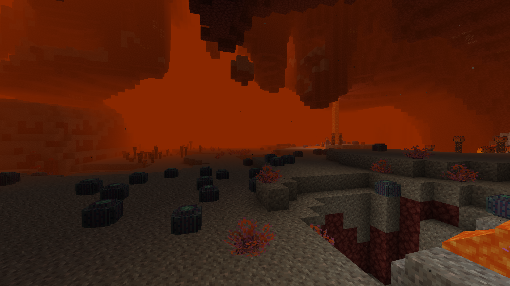

[**Main Page**](https://github.com/paulevsGitch/BetterNether/wiki)

Biomes in mod are volumetric - they have vertical and horizontal variance. As a result you can find another biome digging up or down. Each biome has unique environment and plants.

## Biome List:
* [Empty Nether](https://github.com/paulevsGitch/BetterNether/wiki/Biomes#empty-nether)
* [Gravel Desert](https://github.com/paulevsGitch/BetterNether/wiki/Biomes#gravel-desert)
* [Magma Land](https://github.com/paulevsGitch/BetterNether/wiki/Biomes#magma-land)
* [Mushroom Forest](https://github.com/paulevsGitch/BetterNether/wiki/Biomes#mushroom-forest)
* [Nether Grasslands](https://github.com/paulevsGitch/BetterNether/wiki/Biomes#nether-grasslands)
* [Nether Jungle](https://github.com/paulevsGitch/BetterNether/wiki/Biomes#nether-jungle)
* [Nether Swampland](https://github.com/paulevsGitch/BetterNether/wiki/Biomes#nether-swampland)
* [Wart Forest](https://github.com/paulevsGitch/BetterNether/wiki/Biomes#wart-forest)

## Sub-Biomes List
* [Bone Reef](https://github.com/paulevsGitch/BetterNether/wiki/Biomes#bone-reef)
* [Crimson Glowing Woods](https://github.com/paulevsGitch/BetterNether/wiki/Biomes#crimson-glowing-woods)
* [Crimson Pinewood](https://github.com/paulevsGitch/BetterNether/wiki/Biomes#crimson-pinewood)
* [Mushroom Forest Edge](https://github.com/paulevsGitch/BetterNether/wiki/Biomes#mushroom-forest-edge)
* [Nether Swampland Terraces](https://github.com/paulevsGitch/BetterNether/wiki/Biomes#nether-swampland-terraces)
* [Old Fungiwoods](https://github.com/paulevsGitch/BetterNether/wiki/Biomes#old-fungiwoods)
* [Old Warped Woods](https://github.com/paulevsGitch/BetterNether/wiki/Biomes#old-warped-woods)
* [Poor Grasslands](https://github.com/paulevsGitch/BetterNether/wiki/Biomes#poor-grasslands)
* [Soul Plain](https://github.com/paulevsGitch/BetterNether/wiki/Biomes#soul-plain)
* [Wart Forest Edge](https://github.com/paulevsGitch/BetterNether/wiki/Biomes#wart-forest-edge)

***
# Biomes

<table width="100%">
	<tr>
		<td colspan="2"><h2>Gravel Desert</h2></td>
	</tr>
	<tr>
		<td>
			

				
			

		</td>
		<td>
			

				<b>Gravel Desert</b> is a big semi-empty space of gravel fields with cactuses.
			

			<ul>
				<li><b>Terrain:</b> Gravel</li>
				<li><b>Plants:</b> Nether Cactus, Agave, Barrel Cactus</li>
			</ul>
		</td>
	</tr>
</table>
 

## Gravel Desert
[Back to top](https://github.com/paulevsGitch/BetterNether/wiki/Biomes#biome-list)
* **Description:** Big semi-empty spaces of gravel fields with cactuses.
* **Terrain:** Ground made from Gravel.
* **Plants:** Nether Cactus, Agave, Barrel Cactus.
* **Screenshot:**

## Magma Land

## Mushroom Forest
[Back to top](https://github.com/paulevsGitch/BetterNether/wiki/Biomes#biome-list)
* **Description:** Area covered with medium sized mushrooms and molds. Good place to hide from ghasts.
* **Terrain:** Nether Mycelium and Soul Sand.
* **Plants:** Large mushroom trees - Red and Brown, Lucis, Nether Wart, 3 different colored mushrooms as a source of dyes.
* **Screenshot:**

## Nether Grasslands
[Back to top](https://github.com/paulevsGitch/BetterNether/wiki/Biomes#biome-list)
* **Description:** Grassy places with some bushes.
* **Terrain:** Nether Moss, Netherrack and Soul Sand.
* **Plants:** Egg Plants, Nether Grass, Smoker, Wart Bush, Black Bush, Ink bush, Nether Wart, Black Apple.
* **Screenshot:**

## Nether Jungle
[Back to top](https://github.com/paulevsGitch/BetterNether/wiki/Biomes#biome-list)
* **Description:** Very dense forest of some strange plants.
* **Terrain:** Nether Moss, Netherrack and Soul Sand.
* **Plants:** Egg Plants, Nether Grass, Stalagnate, Lucis, Eyes.
* **Screenshot:**

## Nether Swampland

## Wart Forest
[Back to top](https://github.com/paulevsGitch/BetterNether/wiki/Biomes#biome-list)
* **Description:**  Dense forest of wart trees with some small bushes.
* **Terrain:** Nether Moss and Soul Sand.
* **Plants:** Wart trees, Black bush, Nether Wart.
* **Screenshot:**

***
# Sub-Biomes

## Bone Reef
[Back to top](https://github.com/paulevsGitch/BetterNether/wiki/Biomes#biome-list)
* **Parent Biome:** [Nether Grasslands](https://github.com/paulevsGitch/BetterNether/wiki/Biomes#nether-grasslands)
* **Description:**  Small space covered with bones formations.
* **Terrain:** Nether Moss, Netherrack and Soul Sand.
* **Plants:** Bone mushrooms.
* **Screenshot:**

## Crimson Glowing Woods

## Crimson Pinewood

## Mushroom Forest Edge
[Back to top](https://github.com/paulevsGitch/BetterNether/wiki/Biomes#biome-list)
* **Parent Biome:** [Mushroom Forest](https://github.com/paulevsGitch/BetterNether/wiki/Biomes#mushroom-forest)
* **Description:**  Edge of forest with lower plant density.
* **Terrain:** Nether Mycelium and Soul Sand.
* **Plants:** Nether Wart Trees, Nether Wart, Black Bush.

## Nether Swampland Terraces

## Old Fungiwoods

## Old Warped Woods

## Poor Grasslands
[Back to top](https://github.com/paulevsGitch/BetterNether/wiki/Biomes#biome-list)
* **Parent Biome:** [Nether Grasslands](https://github.com/paulevsGitch/BetterNether/wiki/Biomes#nether-grasslands)
* **Description:**  Grasslands with lower plants density.
* **Terrain:** Nether Moss, Netherrack and Soul Sand.
* **Plants:** Egg Plants, Nether Grass, Smoker, Wart Bush, Black Bush, Ink bush, Nether Wart, Black Apple.

## Soul Plain

## Wart Forest Edge
[Back to top](https://github.com/paulevsGitch/BetterNether/wiki/Biomes#biome-list)
* **Parent Biome:** [Wart Forest](https://github.com/paulevsGitch/BetterNether/wiki/Biomes#wart-forest)
* **Description:**  Edge of forest with lower plant density.
* **Terrain:** Nether Moss and Soul Sand.
* **Plants:** Nether Wart Trees, Nether Wart, Black Bush.