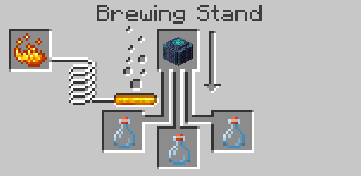

BetterNether adds some blocks to make survival in the Nether easier. They are actually craft station, mostly extending vanilla-ones, but some of them have their own unique abilities.

## Craft Stations List:
- [Netherrack Furnace](#netherrack-furnace)
- [Cincinnasite Forge](#cincinnasite-forge)
- [Cincinnasite Anvil](#cincinnasite-anvil)
- [Nether Brewing Stand](#nether-brewing-stand)

***

<table width="100%">
	<tr>
		<td colspan="2"><h2>Netherrack Furnace</h2></td>
	</tr>
	<tr>
		<td>
			

				<b>Netherrack Furnace</b> is a basic furnace, that works like furnace from cobblestone. It can be easily crafted on the start, like cobblestone furnace from the game.
			

			 
			

				
			

		</td>
		<td width="256">
			
			 
			<ul>
				<li><b>Tool:</b> Pickaxe</li>
				<li><b>Stack:</b> 64</li>
			</ul>
		</td>
	</tr>
</table>
 

<table width="100%">
	<tr>
		<td colspan="2"><h2>Cincinnasite Forge</h2></td>
	</tr>
	<tr>
		<td>
			

				<b>Cincinnasite Forge</b> is more powerful than normal furnace — it can process items with X2 speed consuming same amount of fuel.
			

			 
			

				
			

		</td>
		<td width="256">
			
			 
			<ul>
				<li><b>Tool:</b> Pickaxe</li>
				<li><b>Stack:</b> 64</li>
			</ul>
		</td>
	</tr>
</table>
 

<table width="100%">
	<tr>
		<td colspan="2"><h2>Cincinnasite Anvil</h2></td>
	</tr>
	<tr>
		<td>
			

				<b>Cincinnasite Anvil</b> is a simple anvil made from Forged Cincinnasite and Nether Bricks. It can be used as a normal one.
			

			 
			

				
			

		</td>
		<td width="256">
			
			 
			<ul>
				<li><b>Tool:</b> Pickaxe</li>
				<li><b>Stack:</b> 64</li>
			</ul>
		</td>
	</tr>
</table>
 

<table width="100%">
	<tr>
		<td colspan="2"><h2>Nether Brewing Stand</h2></td>
	</tr>
	<tr>
		<td>
			

				<b>Nether Brewing Stand</b> has a bit different craft recipe than normal one, but can process more recipes (for example - extracting water from Barrel Cactus).
			

			 
			

				
			

		</td>
		<td width="256">
			
			 
			<ul>
				<li><b>Tool:</b> Pickaxe</li>
				<li><b>Stack:</b> 64</li>
			</ul>
		</td>
	</tr>
	<tr>
		<td colspan="2">
			
<b>Recipes:</b>

			 
			

				
			

		</td>
	</tr>
</table>
 