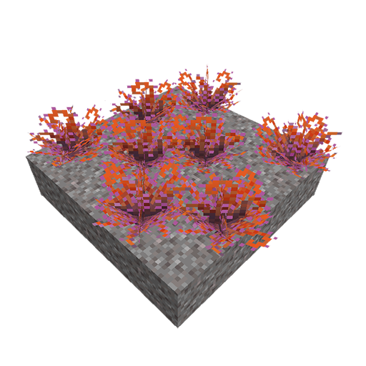
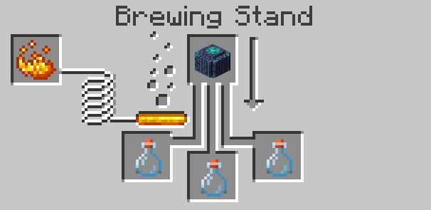
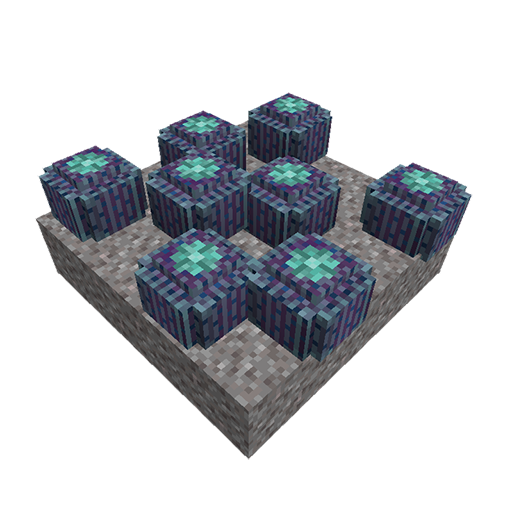
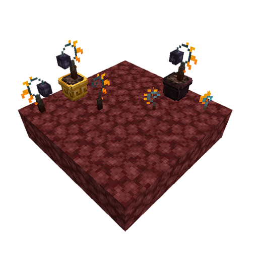
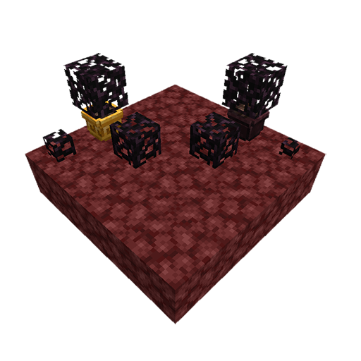

## Plants and Mushrooms List:
* [Agave](https://github.com/paulevsGitch/BetterNether/wiki/Plants#agave)
* [Barrel Cactus](https://github.com/paulevsGitch/BetterNether/wiki/Plants#barrel-cactus)
* [Black Apple](https://github.com/paulevsGitch/BetterNether/wiki/Plants#black-apple)
* [Black Bush](https://github.com/paulevsGitch/BetterNether/wiki/Plants#black-bush)
* [Bone Mushroom](https://github.com/paulevsGitch/BetterNether/wiki/Plants#bone-mushroom)
* [Egg Plants](https://github.com/paulevsGitch/BetterNether/wiki/Plants#egg-plants)
* [Eyes](https://github.com/paulevsGitch/BetterNether/wiki/Plants#eyes)
* [Gray Mold](https://github.com/paulevsGitch/BetterNether/wiki/Plants#gray-mold)
* [Ink Bush](https://github.com/paulevsGitch/BetterNether/wiki/Plants#ink-bush)
* [Large Mushroom Tree Brown](https://github.com/paulevsGitch/BetterNether/wiki/Plants#large-mushroom-tree-brown)
* [Large Mushroom Tree Red](https://github.com/paulevsGitch/BetterNether/wiki/Plants#large-mushroom-tree-red)
* [Lucis](https://github.com/paulevsGitch/BetterNether/wiki/Plants#lucis)
* [Magma Flower](https://github.com/paulevsGitch/BetterNether/wiki/Plants#magma-flower)
* [Nether Cactus](https://github.com/paulevsGitch/BetterNether/wiki/Plants#nether-cactus)
* [Nether Grass](https://github.com/paulevsGitch/BetterNether/wiki/Plants#nether-grass)
* [Nether Moss](https://github.com/paulevsGitch/BetterNether/wiki/Plants#nether-moss)
* [Nether Reeds](https://github.com/paulevsGitch/BetterNether/wiki/Plants#nether-reeds)
* [Nether Wart Mushroom](https://github.com/paulevsGitch/BetterNether/wiki/Plants#nether-wart-mushroom)
* [Orange Mushroom](https://github.com/paulevsGitch/BetterNether/wiki/Plants#orange-mushroom)
* [Red Mold](https://github.com/paulevsGitch/BetterNether/wiki/Plants#red-mold)
* [Stalagnate](https://github.com/paulevsGitch/BetterNether/wiki/Plants#stalagnate)
* [Wart Bush/Seed](https://github.com/paulevsGitch/BetterNether/wiki/Plants#wart-bush/seed)
* [Wart Cap](https://github.com/paulevsGitch/BetterNether/wiki/Plants#wart-cap)
* [Wart Tree](https://github.com/paulevsGitch/BetterNether/wiki/Plants#wart-tree)

***

<table width="100%">
	<tr>
		<td colspan="2">
		<h2>Agave</h2>
		</td>
	</tr>
	<tr>
		<td valign="top">
			

				<b>Agave</b> is decorative plant, common for [[Gravel Desert|Biomes#gravel-desert]]. Can be planted into pot.
			

			 
			<ul>
				<li><b>Tool:</b> Hand</li>
				<li><b>Drop:</b> Itself</li>
				<li><b>Stack:</b> 64</li>
				<li><b>Biomes:</b>
					<ul>
						<li>[[Gravel Desert|Biomes#gravel-desert]]</li>
					</ul>
				</li>
				<li><b>Grows On:</b>
					<ul>
						<li>Gravel</li>
					</ul>
				</li>
			</ul>
		</td>
		<td width="512">
			
		</td>
	</tr>
	<tr>
		<td colspan="2">
			[[Back to top|Plants]]
		</td>
	</tr>
</table>
 

<table width="100%">
	<tr>
		<td colspan="2">
		<h2>Barrel Cactus</h2>
		</td>
	</tr>
	<tr>
		<td valign="top">
			

				<b>Barrel Cactus</b> is a plant, common for [[Gravel Desert|Biomes#gravel-desert]] and useful in potion brewing. Can be planted into pot.
			

			 
			<ul>
				<li><b>Tool:</b> Hand</li>
				<li><b>Drop:</b> Itself</li>
				<li><b>Stack:</b> 64</li>
				<li><b>Biomes:</b>
					<ul>
						<li>[[Gravel Desert|Biomes#gravel-desert]]</li>
					</ul>
				</li>
				<li><b>Grows On:</b>
					<ul>
						<li>Gravel</li>
					</ul>
				</li>
			</ul>
			 
			

				<b>Recipes:</b>
				
In [[Nether Brewing Stand|Craft-Stations#nether-brewing-stand]]:

				
			

		</td>
		<td width="512">
			
		</td>
	</tr>
	<tr>
		<td colspan="2">
			[[Back to top|Plants]]
		</td>
	</tr>
</table>
 

<table width="100%">
	<tr>
		<td colspan="2">
		<h2>Black Apple</h2>
		</td>
	</tr>
	<tr>
		<td valign="top">
			

				<b>Black Apple</b> is grassy plant, rarely founded in [[Nether Grasslands|Biomes#nether-grasslands]]. Its fruit can be used for healing and restore hunger. It has 4 stages of growth.
			

			 
			<ul>
				<li><b>Tool:</b> Hand</li>
				<li><b>Drop:</b> Black Apple Seed, Black Apple (4 stage)</li>
				<li><b>Stack:</b> 64</li>
				<li><b>Biomes:</b>
					<ul>
						<li>[[Nether Grasslands|Biomes#nether-grasslands]]</li>
					</ul>
				</li>
				<li><b>Grows On:</b>
					<ul>
						<li>Netherrack blocks</li>
						<li>Nylium blocks</li>
						<li>Soul Sand|Soil blocks</li>
						<li>Farmland</li>
					</ul>
				</li>
			</ul>
		</td>
		<td width="512">
			
		</td>
	</tr>
	<tr>
		<td colspan="2">
			[[Back to top|Plants]]
		</td>
	</tr>
</table>
 

<table width="100%">
	<tr>
		<td colspan="2">
		<h2>Black Bush</h2>
		</td>
	</tr>
	<tr>
		<td valign="top">
			

				<b>Black Bush</b> is a small cube-shaped bush. It is a decorative plant, with special shape in pots.
			

			 
			<ul>
				<li><b>Tool:</b> Hand</li>
				<li><b>Drop:</b> Itself</li>
				<li><b>Stack:</b> 64</li>
				<li><b>Biomes:</b>
					<ul>
						<li>[[Nether Grasslands|Biomes#nether-grasslands]]</li>
						<li>[[Nether Swampland|Biomes#nether-swampland]]</li>
						<li>[[Nether Swampland Terraces|Biomes#nether-swampland-terraces]]</li>
						<li>[[Poor Nether Grasslands|Biomes#poor-nether-grasslands]]</li>
						<li>[[Soul Plain|Biomes#soul-plain]]</li>
						<li>[[Wart Forest|Biomes#wart-forest]]</li>
						<li>[[Wart Forest Edge|Biomes#wart-forest-edge]]</li>
					</ul>
				</li>
				<li><b>Grows On:</b>
					<ul>
						<li>Netherrack blocks</li>
						<li>Nylium blocks</li>
						<li>Soul Sand|Soil blocks</li>
					</ul>
				</li>
			</ul>
		</td>
		<td width="512">
			
		</td>
	</tr>
	<tr>
		<td colspan="2">
			[[Back to top|Plants]]
		</td>
	</tr>
</table>
 

## Bone Mushroom
[Back to top](https://github.com/paulevsGitch/BetterNether/wiki/Plants)

## Egg Plants
[Back to top](https://github.com/paulevsGitch/BetterNether/wiki/Plants)

## Eyes
[Back to top](https://github.com/paulevsGitch/BetterNether/wiki/Plants)

## Gray Mold
[Back to top](https://github.com/paulevsGitch/BetterNether/wiki/Plants)

## Ink Bush
[Back to top](https://github.com/paulevsGitch/BetterNether/wiki/Plants)

## Large Mushroom Tree Brown
[Back to top](https://github.com/paulevsGitch/BetterNether/wiki/Plants)

## Large Mushroom Tree Red
[Back to top](https://github.com/paulevsGitch/BetterNether/wiki/Plants)

## Lucis
[Back to top](https://github.com/paulevsGitch/BetterNether/wiki/Plants)

## Magma Flower
[Back to top](https://github.com/paulevsGitch/BetterNether/wiki/Plants)

## Nether Cactus
[Back to top](https://github.com/paulevsGitch/BetterNether/wiki/Plants)

## Nether Grass
[Back to top](https://github.com/paulevsGitch/BetterNether/wiki/Plants)

## Nether Moss
[Back to top](https://github.com/paulevsGitch/BetterNether/wiki/Plants)

## Nether Reeds
[Back to top](https://github.com/paulevsGitch/BetterNether/wiki/Plants)

## Nether Wart Mushroom
[Back to top](https://github.com/paulevsGitch/BetterNether/wiki/Plants)

## Orange Mushroom
[Back to top](https://github.com/paulevsGitch/BetterNether/wiki/Plants)

## Red Mold
[Back to top](https://github.com/paulevsGitch/BetterNether/wiki/Plants)

## Stalagnate
[Back to top](https://github.com/paulevsGitch/BetterNether/wiki/Plants)

## Wart Bush/Seed
[Back to top](https://github.com/paulevsGitch/BetterNether/wiki/Plants)

## Wart Cap
[Back to top](https://github.com/paulevsGitch/BetterNether/wiki/Plants)

## Wart Tree
[Back to top](https://github.com/paulevsGitch/BetterNether/wiki/Plants)
